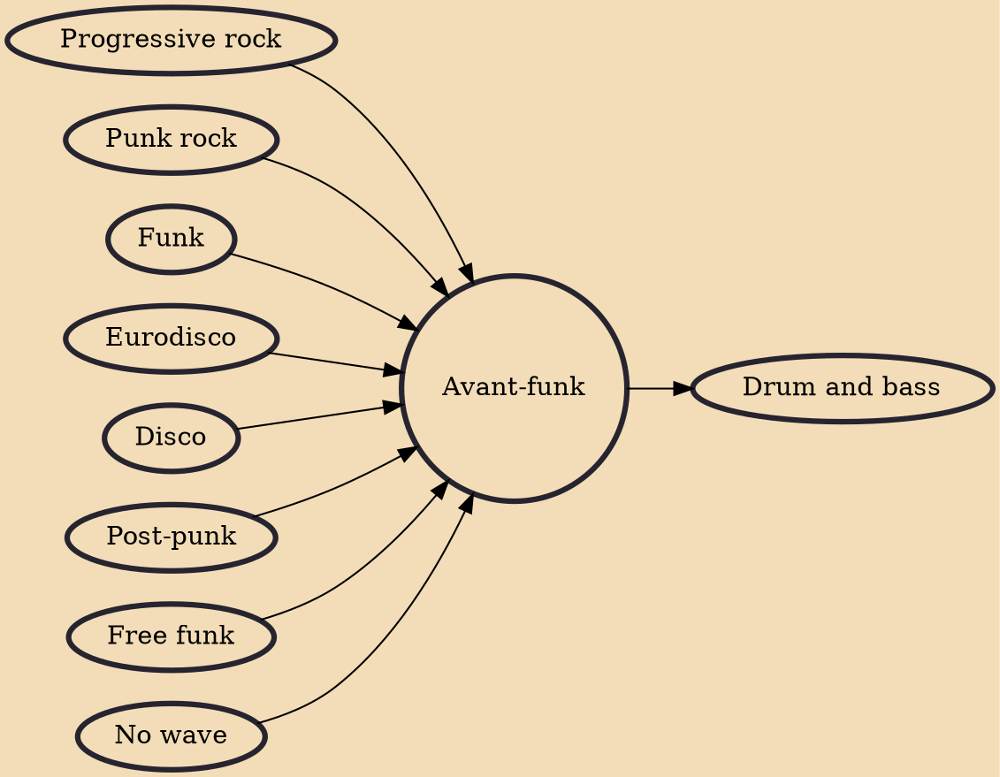

Avant-funk (also called mutant disco in the early 1980s) is a music style in which artists combine funk and disco rhythms with an avant-garde or art rock mentality. Its most prominent era occurred in the late 1970s and 1980s among post-punk and no wave acts who embraced black dance music.

## Influences
- [[Progressive rock]]
- [[Punk rock]]
- [[Funk]]
- [[Eurodisco]]
- [[Disco]]
- [[Post-punk]]
- [[Free funk]]
- [[No wave]]

## Derivatives
- [[Drum and bass]]
