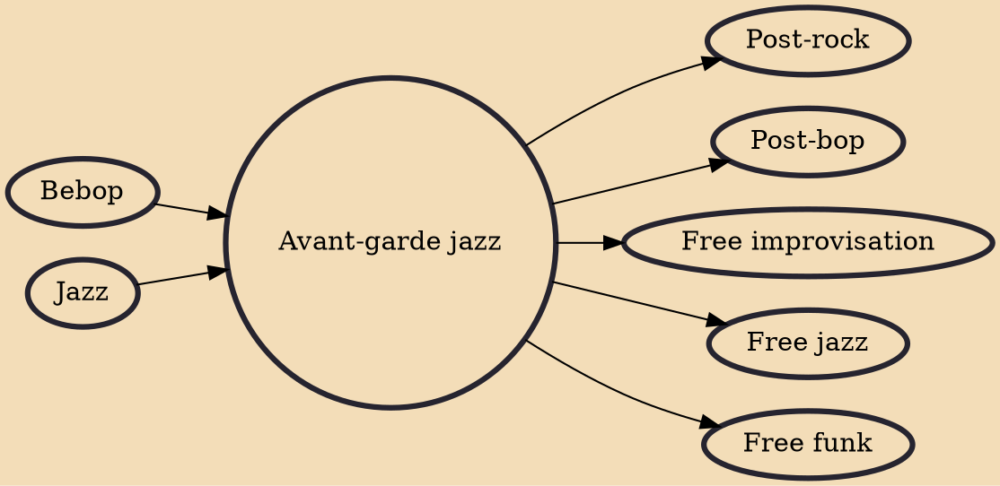

Avant-garde jazz (also known as avant-jazz and experimental jazz) is a style of music and improvisation that combines avant-garde art music and composition with jazz. It originated in the early 1950s and developed through to the late 1960s. Originally synonymous with free jazz, much avant-garde jazz was distinct from that style.

## Influences

- [[Bebop]]
- [[Jazz]]

## Derivatives

- [[Post-rock]]
- [[Post-bop]]
- [[Free improvisation]]
- [[Free jazz]]
- [[Free funk]]
