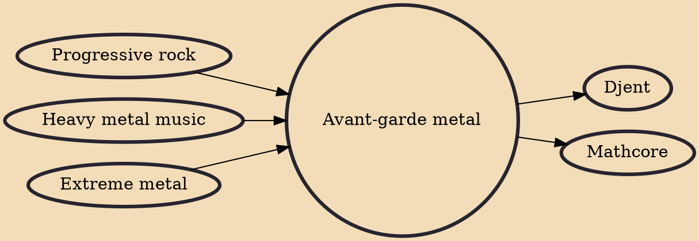

Avant-garde metal (also known as avant-metal, experimental metal, and experimental) is a subgenre of heavy metal music loosely defined by use of experimentation and innovative, avant-garde elements, including non-standard and unconventional sounds, instruments, song structures, playing styles, and vocal techniques. Avant-garde metal is influenced by progressive rock and extreme metal, particularly death metal, and is closely related to progressive metal. Some local scenes include Los Angeles, the San Francisco Bay Area, Boston, and Seattle in the United States, Oslo in Norway, and Tokyo in Japan.

## Influences
- [[Progressive rock]]
- [[Heavy metal music]]
- [[Extreme metal]]

## Derivatives
- [[Djent]]
- [[Mathcore]]
