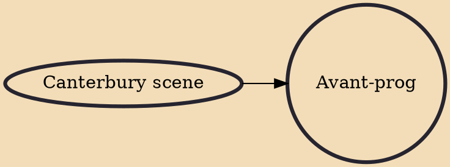

Avant-prog (short for avant-garde progressive rock) is a music genre that appeared in the late 1970s as the extension of two separate progressive rock subgenres: Rock in Opposition (RIO) and the Canterbury scene.

## Influences
- [[Canterbury scene]]
