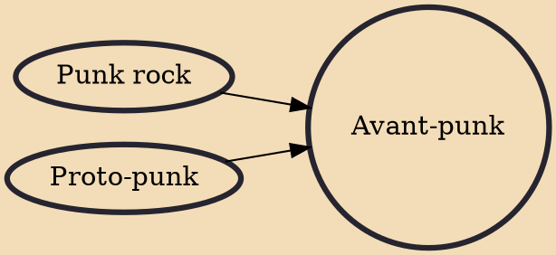

Avant-punk is a punk music style characterized by "screeching experimentation," and a term by which critics used to describe the wave of American punk bands from the 1970s. It originated with the New York-based rock band the Velvet Underground, while antecedents included early Kinks and garage band one-shots collected on the Nuggets series of compilation albums. According to critic Robert Christgau, between 1966 and 1975, the only notable acts who could be categorized as "avant-punk" were the Velvets, MC5, Iggy Pop and the Stooges, the Modern Lovers, and the New York Dolls.

## Influences

- [[Punk rock]]
- [[Proto-punk]]
