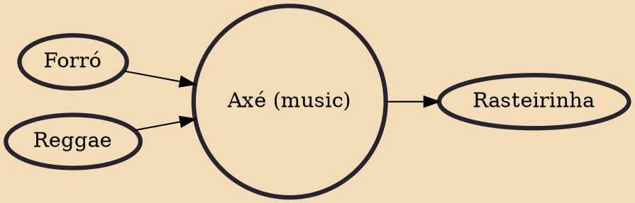

Axé (Portuguese pronunciation: [aˈʃɛ]) is a popular music genre originated in Salvador, Bahia, Brazil in the 1980s, fusing different Afro-Caribbean genres, such as marcha, reggae, and calypso. It also includes influences of Brazilian music such as frevo, forró and carixada. The word Axé comes from the Yoruba term àṣẹ, meaning “soul, light, spirit or good vibrations”. Axé is also present in the Candomblé religion, as “the imagined spiritual power and energy bestowed upon practitioners by the pantheon of orixás”. Not only is axé present in the Candomblé religion, but it also has ties with the Roman Catholic Church and the Lenten season, which represents the roots of how carnival came to be.

## Influences

- [[Forró]]
- [[Reggae]]

## Derivatives

- [[Rasteirinha]]
