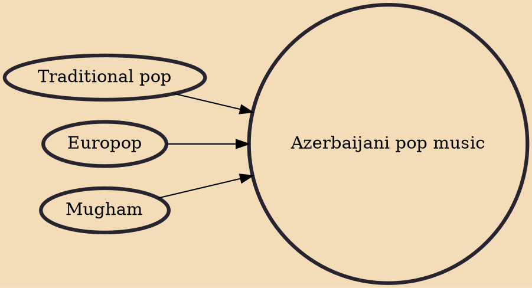

Azerbaijani pop music (Azerbaijani: Azərbaycan pop musiqisi) is a pop music created in Azerbaijan. The emergence of Azerbaijani pop music dates back to the mid-20th century. Growth of new generation of musicians in the 1970s positively influenced Azerbaijan pop music's "golden age". Performers of traditional pop music such as Mirza Babayev, Flora Karimova and Shovkat Alakbarova achieved great success at that time. Contemporary Azerbaijani pop music has its roots in traditional Azerbaijani folk music.

## Influences

- [[Traditional pop]]
- [[Europop]]
- [[Mugham]]
