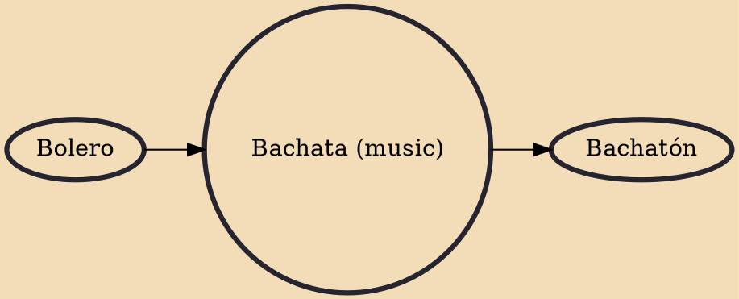

Bachata is a genre of music that originated in the Dominican Republic in the 20th century. It is a fusion of southwestern European influences, mainly Spanish guitar music, with indigenous Taino and Sub Saharan African musical elements, representative of the cultural diversity of the Dominican population.

## Influences
- [[Bolero]]

## Derivatives
- [[Bachatón]]
