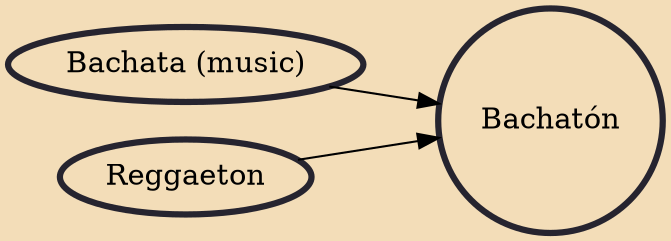

Bachatón (also known as bachateo) is a fusion genre of reggaeton from Puerto Rico and bachata from the Dominican Republic. Bachaton combines bachata melodies and reggaeton style beats, lyrics, rapping, and disc jockeying. The word "bachatón" is a combination of "bachata" and "reggaeton". "Bachatón" was coined and widely accepted in 2005. It is a subgenre of reggaeton and bachata.

## Influences

- [[Bachata (music)]]
- [[Reggaeton]]
