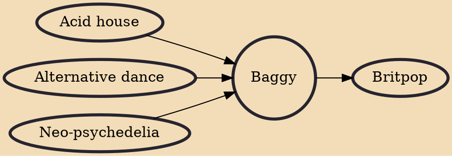

Baggy was a name given to a British alternative dance genre popular in the late 1980s and early 1990s, with many of the artists referred to as "baggy" being bands from the Madchester scene.

## Influences
- [[Acid house]]
- [[Alternative dance]]
- [[Neo-psychedelia]]

## Derivatives
- [[Britpop]]
