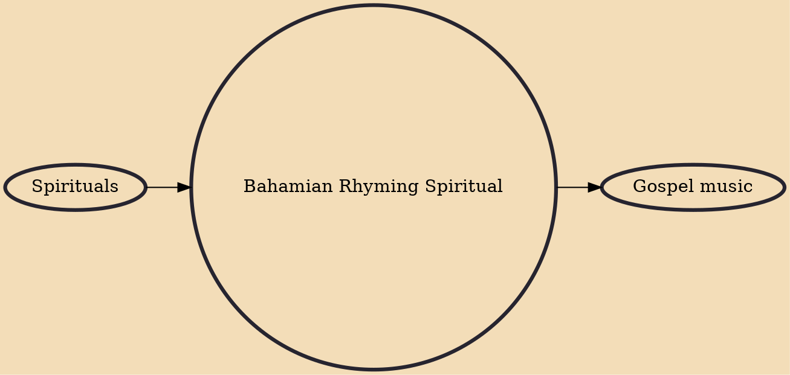

Bahamian rhyming spiritual is a religious genre of music found in the Bahamas, and also the songs, usually spirituals, and vocal-style within that genre. Rhyming does not refer to rhyme but to verse, the rhymer, or lead-singer, singing the couplets of the verses against the sung background of the repeated chorus. Rhyming was most popular during the sponge fishing of the 1930s (the sponges having been killed by a fungus), and Peter Elliot is considered the best rhymer.

## Influences

- [[Spirituals]]

## Derivatives

- [[Gospel music]]
