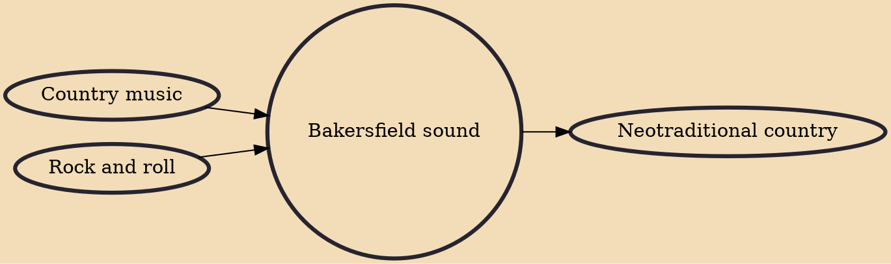

The Bakersfield sound is a sub-genre of country music developed in the mid-to-late 1950s in and around Bakersfield, California. Bakersfield was the first subgenre of country music significantly influenced by rock and roll, relying heavily on electric instrumentation and a strongly defined backbeat. It was also a reaction against the slickly produced, orchestra-laden Nashville sound, which was becoming popular in the late 1950s. The Bakersfield sound became one of the most popular and influential country genres of the 1960s, initiating a revival of honky-tonk music and influencing later country rock and outlaw country musicians.

## Influences
- [[Country music]]
- [[Rock and roll]]

## Derivatives
- [[Neotraditional country]]
