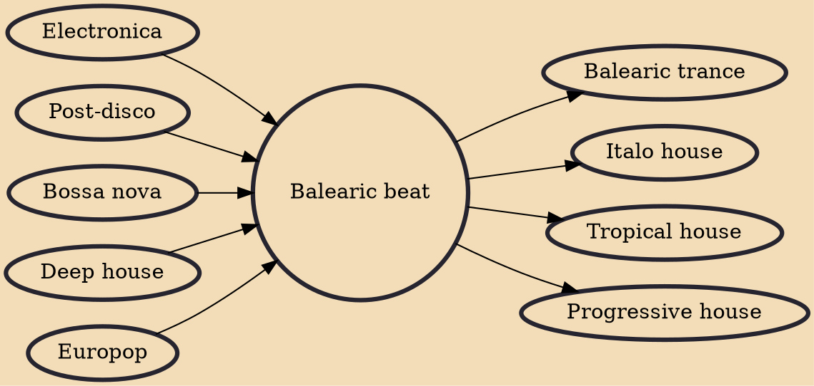

Balearic beat, also known as Balearic house, Balearic, Ibiza house or Ibizan chillout, is an eclectic blend of DJ-led dance music that emerged in the mid-1980s. It later became the name of a more specific style of electronic dance music that was popular into the mid-1990s. Balearic beat was named for its popularity among European nightclub and beach rave patrons on the Balearic island of Ibiza, a popular tourist destination. Some dance music compilations referred to it as "the sound of Ibiza", even though many other, more aggressive and upbeat forms of dance music could be heard on the island, such as Balearic trance.

## Influences

- [[Electronica]]
- [[Post-disco]]
- [[Bossa nova]]
- [[Deep house]]
- [[Europop]]

## Derivatives

- [[Balearic trance]]
- [[Italo house]]
- [[Tropical house]]
- [[Progressive house]]
