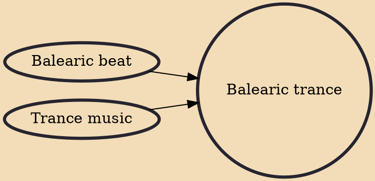

Balearic trance, also known as Ibiza trance is a trance music subgenre which evolved from Balearic beat. The earliest known Balearic trance compositions date back to a few years after the emergence of Balearic beat in the 1990s.

## Influences

- [[Balearic beat]]
- [[Trance music]]
