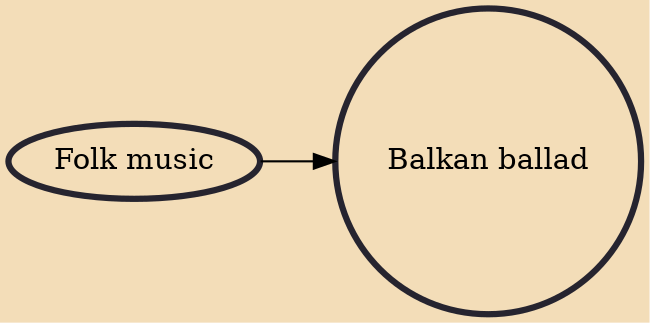

Balkan ballads (also known as Balkan folk ballads) are the emotional, slow music styles of the Balkan region of Southeastern Europe. Balkan ballads, similar to other ballads, often deal with various themes related to love (unrequited love, love-sickness, romantic and intimate relationships) while using Balkan string instruments such as the šargija, as well as the clarinet, trumpet, accordion, fiddle, guitar and bass guitar. Balkan ballads are distinct from traditional ballads by including a fusion of pop music, folk music and sentimental ballads. Singers usually perform in their native languages.

## Influences

- [[Folk music]]
