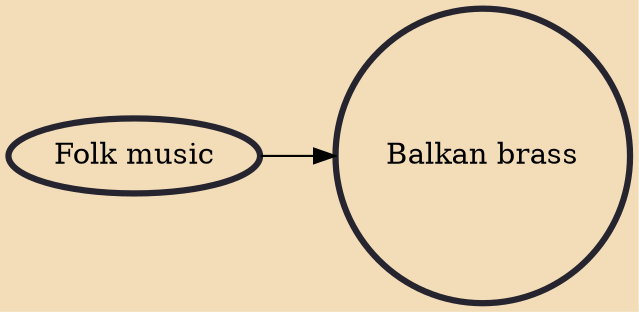

Balkan brass, popularly known by the Serbian name Truba (Serbian Cyrillic: Труба, "Trumpet"), is a distinctive style of music originating in the Balkan region as a fusion between military music and folk music. In recent years, it has become popular in a techno-synth fusion throughout Europe, and in pop music in the Anglo-American sphere and throughout the world. Songs like Worth It by Fifth Harmony have brought the style to a new audience. In traditional form, it is popular throughout the Balkans, especially in Serbia, North Macedonia, Bulgaria, Moldova and Romania, although the turbo-folk variety attracts larger audiences. The energetic and fast beats encourage dance and are egalitarian, often resulting in participation by the entire audience; this unpretentious relationship with audience

## Influences

- [[Folk music]]
