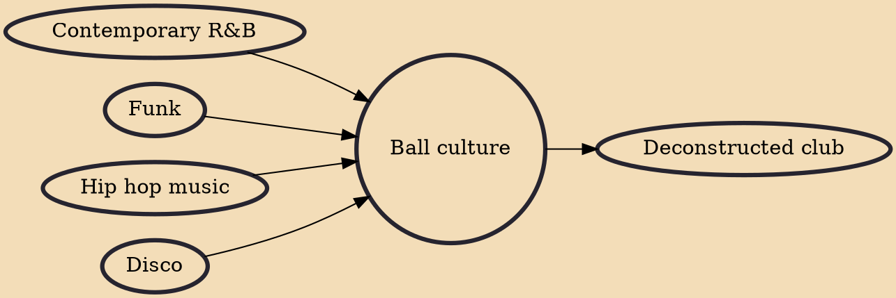

The Ballroom Scene (also known as the Ballroom community, Ballroom culture, or just Ballroom) is an African-American and Latino underground LGBTQ+ subculture that originated in New York City. Beginning in the late 20th century, Black and Latino drag queens began to organize their own pageants in opposition to racism experienced in established drag queen pageant circuits. Though racially integrated for the participants, the judges of these circuits were mostly white people. While the initial establishment of Ballroom mimicked these drag queen pageants, the inclusion of gay men and trans women would transform the Ballroom scene into what it is today: a multitude of categories that all LGBTQ+ people can participate in.Attendees "walk" these categories for trophies and cash prizes. Most partic

## Influences
- [[Contemporary R&B]]
- [[Funk]]
- [[Hip hop music]]
- [[Disco]]

## Derivatives
- [[Deconstructed club]]
