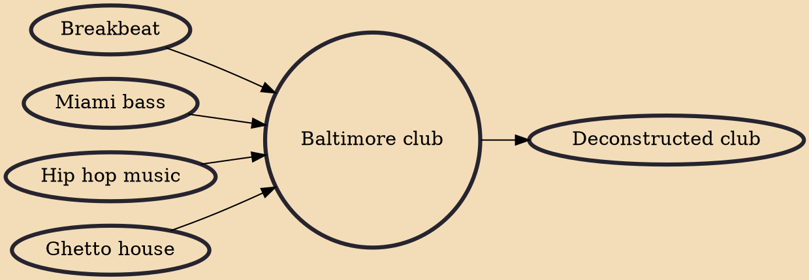

Baltimore club, also called Bmore club, Bmore house or simply Bmore, is a fusion of breakbeat and house genres. It is often referred to as a blend of hip hop and chopped, staccato house music. It was created in Baltimore, Maryland, United States in the early 1990s by 2 Live Crew's Luther Campbell, Frank Ski, Miss Tony (known as Big Tony after he stopped presenting in drag), Scottie B. and DJ Spen.

## Influences
- [[Breakbeat]]
- [[Miami bass]]
- [[Hip hop music]]
- [[Ghetto house]]

## Derivatives
- [[Deconstructed club]]
