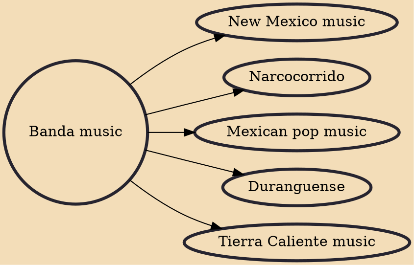

Banda is a genre of Regional Mexican music and type of ensemble in which wind (mostly brass) and percussion instruments are performed. The history of banda music in Mexico dates from the middle of the 19th century with the arrival of piston brass instruments, when community musicians tried to imitate military bands. The first bandas were formed in Southern and Central Mexico. Many types of bandas exist in different territories and villages, playing traditional or modern music, organized privately or municipally.

## Derivatives

- [[New Mexico music]]
- [[Narcocorrido]]
- [[Mexican pop music]]
- [[Duranguense]]
- [[Tierra Caliente music]]
