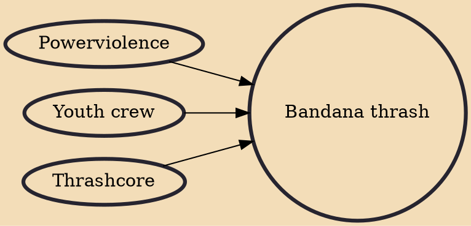

Bandana thrash is a movement within thrashcore, that is sometimes associated with powerviolence that explored their debt to an earlier form of extreme punk rock. The term is in reference to the headgear preferred by many of the performers. The ideology of bandana thrash is DIY ethic, in many cases straight edge, street life, anticonsumerism, and worldwide unity, the latter is referred in many songs like "Bandana United Us" by GxHx, "Intercontinental Bandana Union", by What Happens Next?, as well in the manifesto in Conquest for Death's Many Nations, One Underground". The style was prominent into the early to mid 2000s.

## Influences

- [[Powerviolence]]
- [[Youth crew]]
- [[Thrashcore]]
