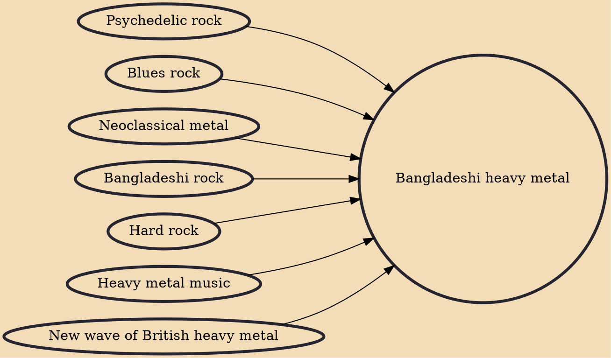

Bangladeshi heavy metal or Bangla heavy metal was originated from the evolution of British and American heavy metal bands of the 1980s. Bands like Iron Maiden, Metallica and Megadeth have had the greatest influences on Bangladeshi heavy metal musicians. Other 1970s bands to influence are bands like Deep Purple, Black Sabbath and Motörhead. The first bands to play heavy metal in Bangladesh were bands like Warfaze and . The most prominent era for heavy metal movement was between the early 1990s to early 2000s. Warfaze, Rockstrata, Aces and In Dhaka are often considered as the "big four founders of heavy metal". Other 2000s metal bands are bands like Artcell, Aurthohin, Cryptic Fate, Powersurge, Mechanix, Metal Maze, Vibe and Stentorian. Alternative bands like Nemesis, Arbovirus and Black als

## Influences

- [[Psychedelic rock]]
- [[Blues rock]]
- [[Neoclassical metal]]
- [[Bangladeshi rock]]
- [[Hard rock]]
- [[Heavy metal music]]
- [[New wave of British heavy metal]]
