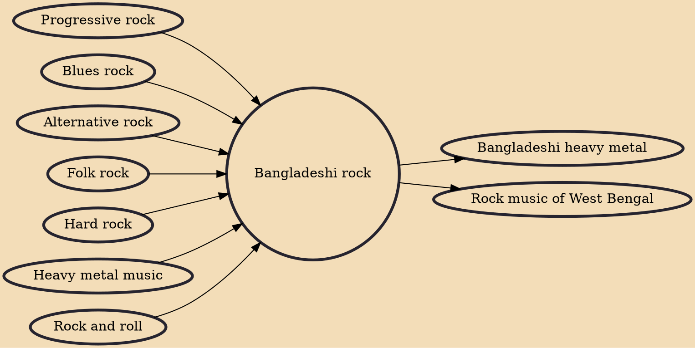

Bangladeshi rock music or Bangla rock music is a style of music in Bangladesh that is derived from British and American rock music, mixed with Bengali classical and adhunik musical styles from the 1960s. The genre was introduced in the 1960s by a few bands who began developing a distinctive rock sound of Bangladesh. Bangladeshi rock is commonly divided into two categories; the "East Pakistan" rock scene, and the "Bangladesh" rock scene. From the 1970s to the 2000s, it was one of the nation's most popular musical genres.

## Influences

- [[Progressive rock]]
- [[Blues rock]]
- [[Alternative rock]]
- [[Folk rock]]
- [[Hard rock]]
- [[Heavy metal music]]
- [[Rock and roll]]

## Derivatives

- [[Bangladeshi heavy metal]]
- [[Rock music of West Bengal]]
