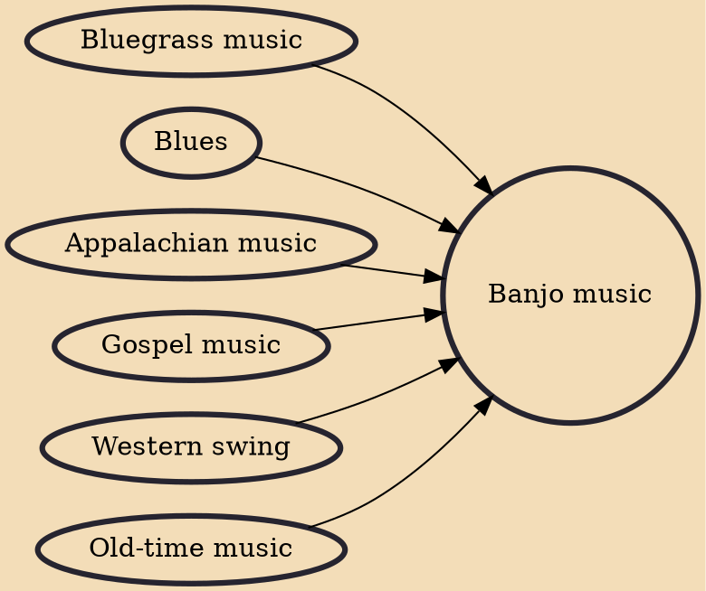

Banjo music is a genre of music that consists exclusively, or primarily of, the banjo. Banjo music can be played as a solo, or it can be played with a band. Banjo music can be played with all types of banjos (four, five, or six string).

## Influences
- [[Bluegrass music]]
- [[Blues]]
- [[Appalachian music]]
- [[Gospel music]]
- [[Western swing]]
- [[Old-time music]]
