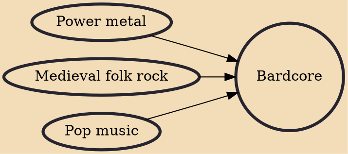

Bardcore or tavernwave is a musical microgenre that became popular in 2020, consisting of medieval-inspired remakes of popular songs.

## Influences
- [[Power metal]]
- [[Medieval folk rock]]
- [[Pop music]]
