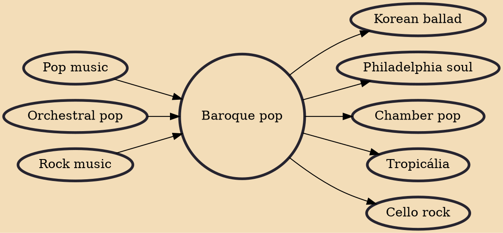

Baroque pop (sometimes called baroque rock) is a fusion genre that combines rock music with particular elements of classical music. It emerged in the mid 1960s as artists pursued a majestic, orchestral sound and is identifiable for its appropriation of Baroque compositional styles (contrapuntal melodies and functional harmony patterns) and dramatic or melancholic gestures. Harpsichords figure prominently, while oboes, French horns, and string quartets are also common.

## Influences

- [[Pop music]]
- [[Orchestral pop]]
- [[Rock music]]

## Derivatives

- [[Korean ballad]]
- [[Philadelphia soul]]
- [[Chamber pop]]
- [[Tropicália]]
- [[Cello rock]]
