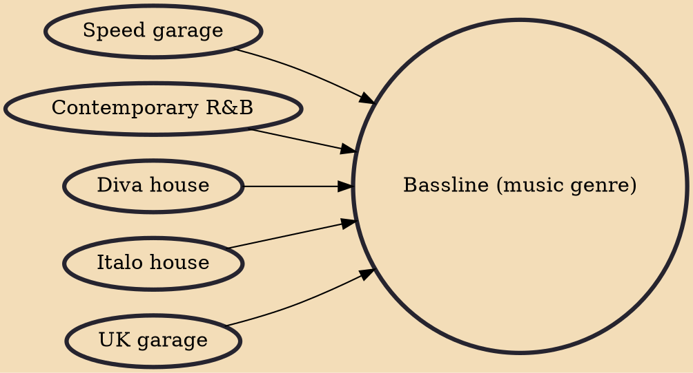

Bassline (sometimes referred to as bassline house, organ house, Niche, B-Line, or 4x4) is a music genre related to UK garage that originated in Yorkshire and the Midlands in the early 2000s. Stylistically it comprises a four-to-the-floor rhythm normally at around 135–142 beats per minute and a strong emphasis on bass, similar to that of its precursor speed garage, with chopped up vocal samples and a pop music aesthetic.

## Influences
- [[Speed garage]]
- [[Contemporary R&B]]
- [[Diva house]]
- [[Italo house]]
- [[UK garage]]
