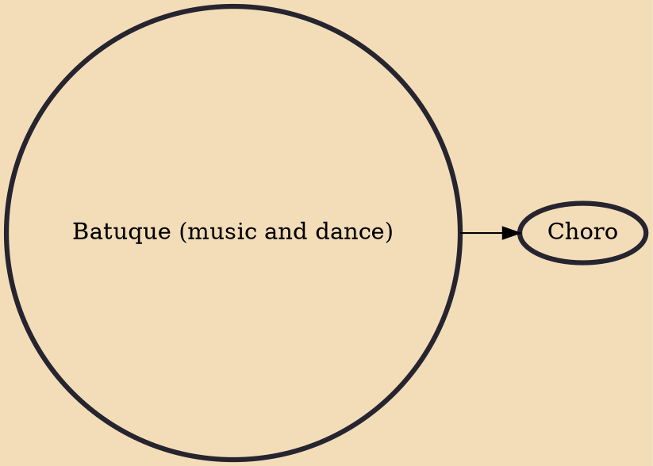

```dot
digraph {
	graph [bgcolor="#F3DDB8" rankdir=LR]
	node [color="#26242F" penwidth=3.0]
	"Batuque (music and dance)" [shape=circle]
	Choro [URL="/choro/"]
	"Batuque (music and dance)" -> Choro
}
```

The Batuque is a music and dance genre from Cape Verde.

## Derivatives
- [[Choro]]
