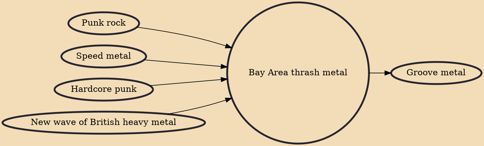

Bay Area thrash metal (also known as Bay Area thrash) referred to a steady following of heavy metal bands in the 1980s who formed and gained international status in the San Francisco Bay Area in California. Along with Central Florida, the scene was widely regarded as a starting point of American thrash metal, crossover thrash and death metal.

## Influences

- [[Punk rock]]
- [[Speed metal]]
- [[Hardcore punk]]
- [[New wave of British heavy metal]]

## Derivatives

- [[Groove metal]]
