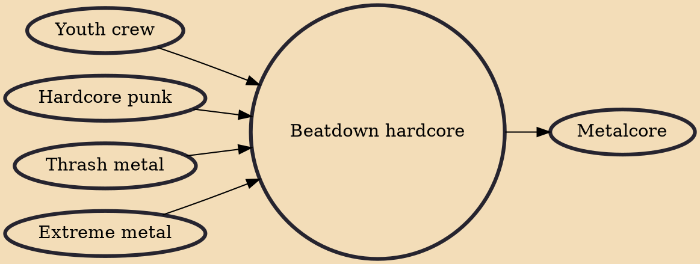

Beatdown hardcore (also known as heavy hardcore, brutal hardcore, toughguy, moshcore, or simply beatdown) is a subgenre of hardcore punk with prominent elements of heavy metal. Beatdown hardcore features aggressive vocals, down-tuned electric guitars, gang vocals, heavy guitar riffs, and heavy breakdowns. The genre emerged in the late 1980s and early 1990s with bands such as Killing Time, Madball, and Sheer Terror. In the mid-late 1990s and early 2000s, many other beatdown bands emerged, such as Hatebreed, Bulldoze, Shai Hulud, and Strife. Bands such as Terror and Death Before Dishonor gained cult followings in the mid–late 2000s. New York hardcore bands such as Agnostic Front, Warzone, Sick of It All, and Cro-Mags and the thrash metal subgenre crossover thrash (e.g.: Suicidal Tendencies a

## Influences

- [[Youth crew]]
- [[Hardcore punk]]
- [[Thrash metal]]
- [[Extreme metal]]

## Derivatives

- [[Metalcore]]
