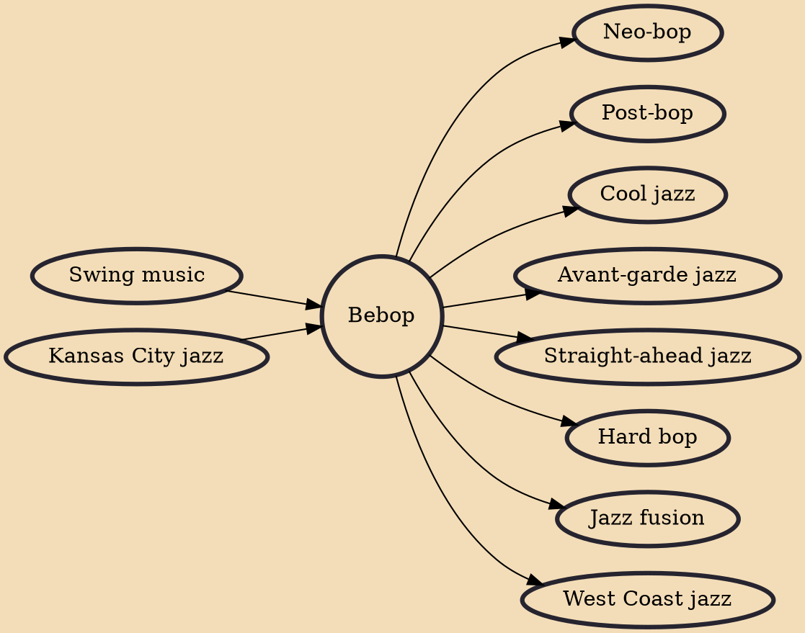

Bebop or bop is a style of jazz developed in the early-to-mid-1940s in the United States. The style features compositions characterized by a fast tempo, complex chord progressions with rapid chord changes and numerous changes of key, instrumental virtuosity, and improvisation based on a combination of harmonic structure, the use of scales and occasional references to the melody.

## Influences

- [[Swing music]]
- [[Kansas City jazz]]

## Derivatives

- [[Neo-bop]]
- [[Post-bop]]
- [[Cool jazz]]
- [[Avant-garde jazz]]
- [[Straight-ahead jazz]]
- [[Hard bop]]
- [[Jazz fusion]]
- [[West Coast jazz]]
