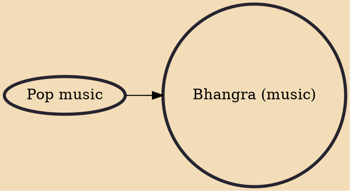

Bhangra (Punjabi pronunciation: [pə̀ŋɡ(ə)ɽaː]) is a type of non-traditional music of Punjab originating in the Southall area of United Kingdom. It is a type of upbeat popular music associated with the Punjabi diaspora in Britain. The style has its origins in the folk music of Punjab as well as western pop music of the 1970s and 1980s. Prior to this musical fusion, Bhangra existed only as a dance form in the native Punjab. This British music was unique in that it was not traditional nor did it seek any authenticity. While the traditional folk music of Punjab has a set of melodies that are used by various singers, Bhangra was a form of strict "band culture" in that new melodies were composed for each song. Therefore, the musicians were as important as the singers.

## Influences

- [[Pop music]]
