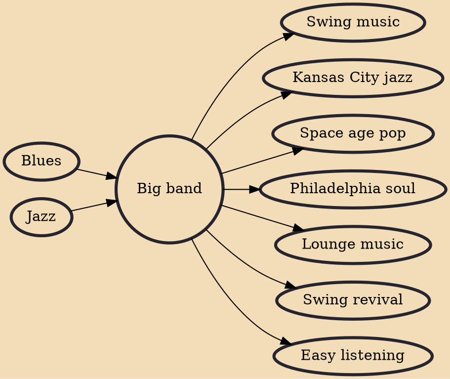

A big band or jazz orchestra is a type of musical ensemble of jazz music that usually consists of ten or more musicians with four sections: saxophones, trumpets, trombones, and a rhythm section. Big bands originated during the early 1910s and dominated jazz in the early 1940s when swing was most popular. The term "big band" is also used to describe a genre of music, although this was not the only style of music played by big bands.

## Influences
- [[Blues]]
- [[Jazz]]

## Derivatives
- [[Swing music]]
- [[Kansas City jazz]]
- [[Space age pop]]
- [[Philadelphia soul]]
- [[Lounge music]]
- [[Swing revival]]
- [[Easy listening]]
