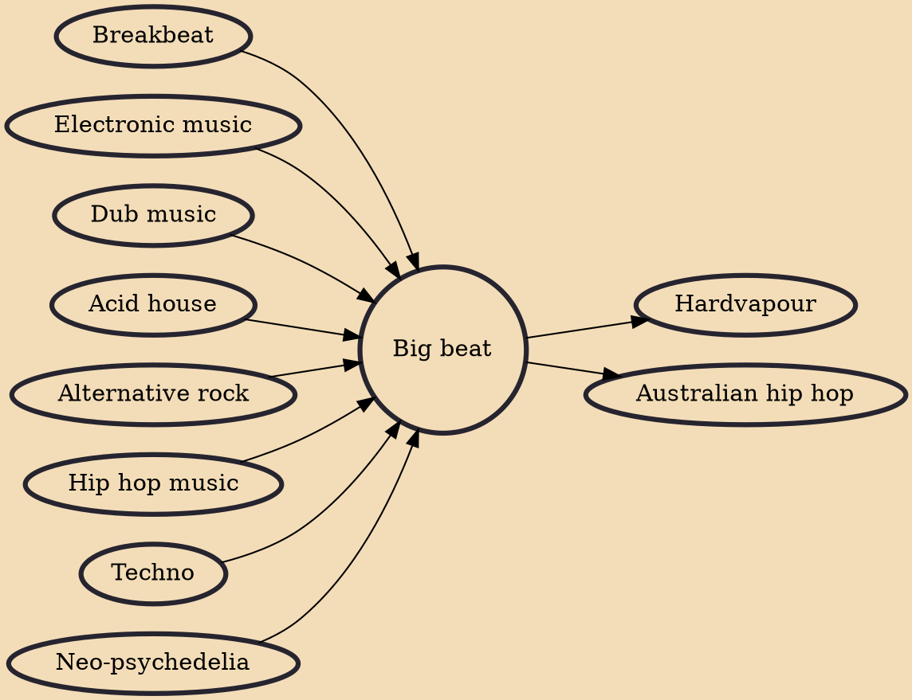

Big beat is an electronic music genre that usually uses heavy breakbeats and synthesizer-generated loops and patterns – common to acid house/techno. The term has been used by the British music industry to describe music by artists such as the Prodigy, the Chemical Brothers, Fatboy Slim, the Crystal Method, Propellerheads, Basement Jaxx and Groove Armada.

## Influences

- [[Breakbeat]]
- [[Electronic music]]
- [[Dub music]]
- [[Acid house]]
- [[Alternative rock]]
- [[Hip hop music]]
- [[Techno]]
- [[Neo-psychedelia]]

## Derivatives

- [[Hardvapour]]
- [[Australian hip hop]]
