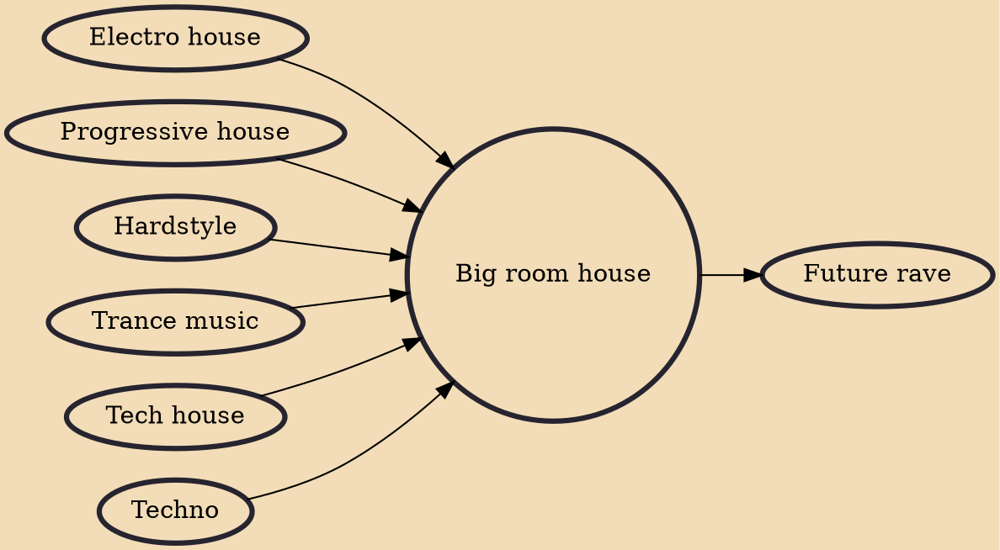

Big room house or simply big room is a fusion subgenre of house music (notably progressive house and electro house) that gained popularity in the early 2010s. Characterized by its simple instrumentation yet complex structure, big room house soon evolutionized the EDM scene into multiple subgenres that we know today.

## Influences
- [[Electro house]]
- [[Progressive house]]
- [[Hardstyle]]
- [[Trance music]]
- [[Tech house]]
- [[Techno]]

## Derivatives
- [[Future rave]]
