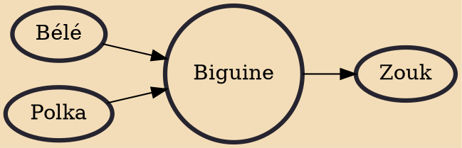

Biguine (/bɪˈɡɪn/ big-IN, French: [biɡin]; Antillean Creole: bigin) is a rhythm-centric style of music that originated from Saint Pierre, Martinique in the 19th century. It fuses Bèlè and 19th-century French ballroom dance steps with African rhythms.

## Influences

- [[Bélé]]
- [[Polka]]

## Derivatives

- [[Zouk]]
