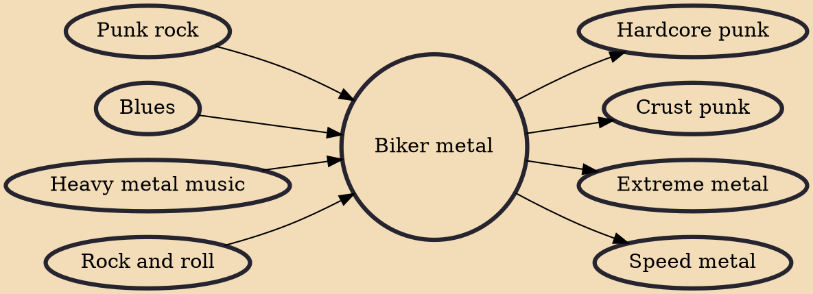

Biker metal (also known as biker punk) is a fusion genre that combines elements of punk rock, heavy metal, rock and roll and blues, that was pioneered in the late-1970s to early-1980s in England and the United States, by Motörhead, Plasmatics, Anti-Nowhere League and Girlschool.

## Influences

- [[Punk rock]]
- [[Blues]]
- [[Heavy metal music]]
- [[Rock and roll]]

## Derivatives

- [[Hardcore punk]]
- [[Crust punk]]
- [[Extreme metal]]
- [[Speed metal]]
