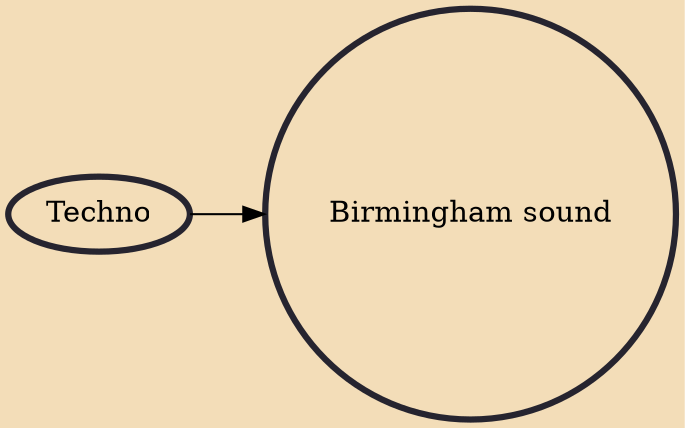

The Birmingham sound is a subgenre of techno that emerged in Birmingham, England in the early 1990s. It is most commonly associated with the city's House of God club night, the Downwards Records label, and the local DJs and producers Regis, Surgeon and . It is characterised by a hard, fast and uncompromising style that strips the music of the bassline funk that characterised the techno of Detroit and Berlin, leaving only "huge slabs of unrelentingly unchanging minimalism".

## Influences

- [[Techno]]
