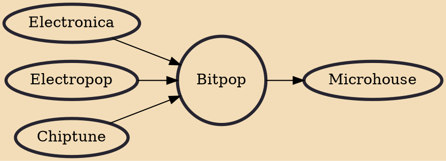

Bitpop is a type of electronic music and subgenre of chiptune music, where at least part of the music is made using the sound chips of old 8-bit (or 16-bit) computers and video game consoles.

## Influences

- [[Electronica]]
- [[Electropop]]
- [[Chiptune]]

## Derivatives

- [[Microhouse]]
