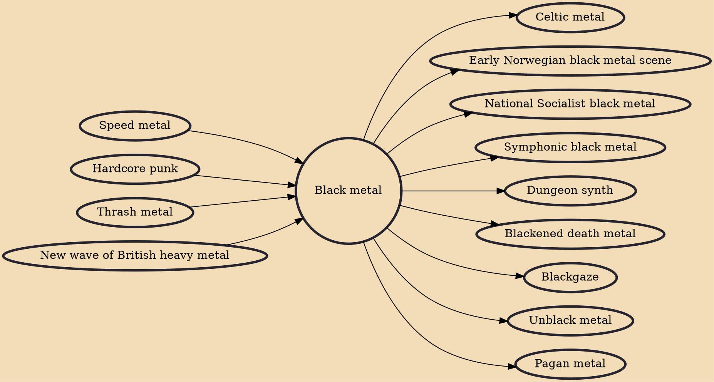

Black metal is an extreme subgenre of heavy metal music. Common traits include fast tempos, a shrieking vocal style, heavily distorted guitars played with tremolo picking, raw (lo-fi) recording, unconventional song structures, and an emphasis on atmosphere. Artists often appear in corpse paint and adopt pseudonyms.

## Influences

- [[Speed metal]]
- [[Hardcore punk]]
- [[Thrash metal]]
- [[New wave of British heavy metal]]

## Derivatives

- [[Celtic metal]]
- [[Early Norwegian black metal scene]]
- [[National Socialist black metal]]
- [[Symphonic black metal]]
- [[Dungeon synth]]
- [[Blackened death metal]]
- [[Blackgaze]]
- [[Unblack metal]]
- [[Pagan metal]]
