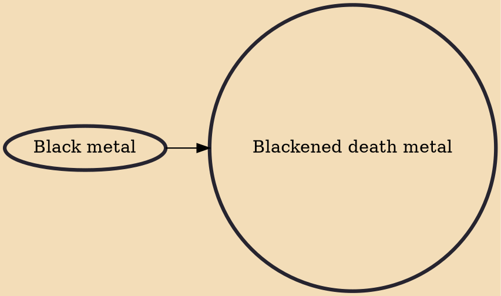

Blackened death metal (also known as black death metal) is an extreme subgenre of heavy metal that fuses elements of black metal and death metal. The genre emerged in early 1990s when black metal bands began incorporating elements of death metal and vice versa. The genre typically employs death growls, tremolo picking, blast beats, and Satanic lyrics and imagery. Bands of the genre typically employ corpse paint, which was adapted from black metal.

## Influences
- [[Black metal]]
