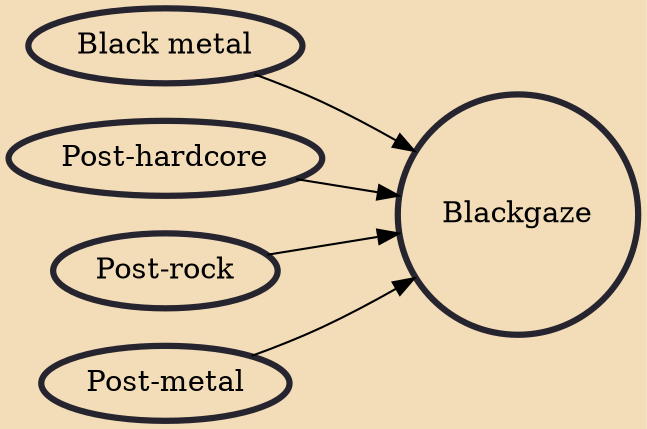

Blackgaze is a fusion genre combining elements of black metal and shoegaze. The word is a blend of the names of the two genres, described by The Guardian as "the buzz term for a new school of bands taking black metal out of the shadows and melding its blast beats, dungeon wailing and razorwire guitars with the more reflective melodies of post-rock, shoegaze and post-hardcore." According to Exclaim!, blackgaze "marries the harsh, alien instrumentation of black metal with the mellower, dreamy soundscapes of shoegaze."

## Influences
- [[Black metal]]
- [[Post-hardcore]]
- [[Post-rock]]
- [[Post-metal]]
