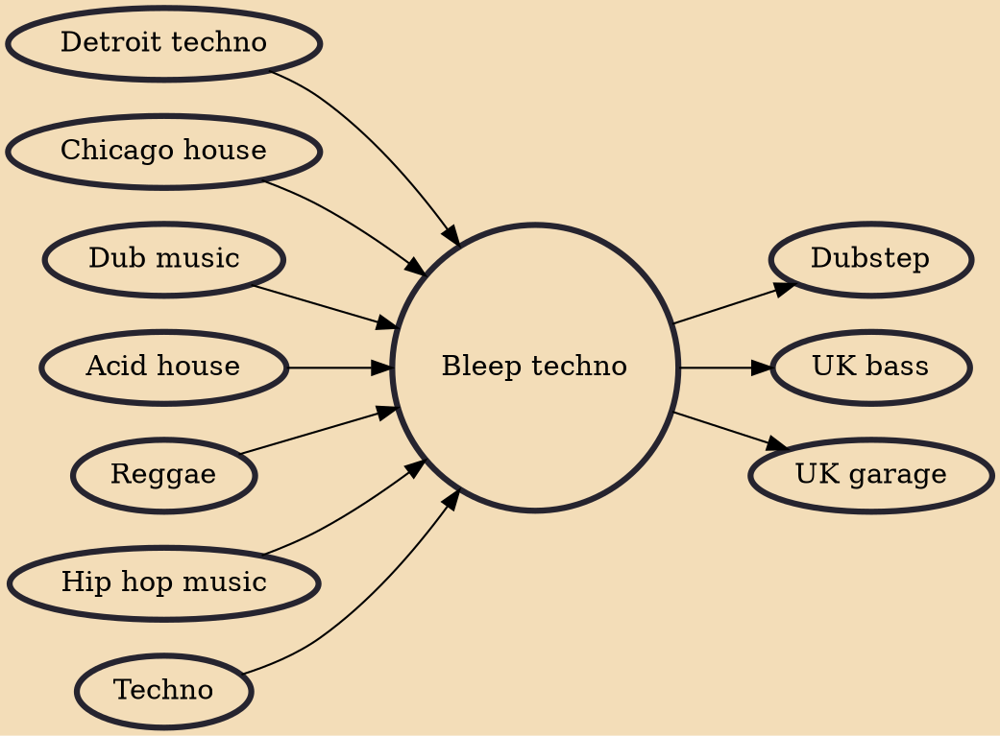

Bleep techno (or simply bleep) is a regional subgenre of techno which developed in the late 1980s in Northern England, specifically Yorkshire. Named after its minimalistic synthesizer sounds, bleep techno combined influence from American techno and house with electro elements and heavy sub-bass inspired by reggae. The style was commercially successful between 1989 and 1991, and became associated with artists on the Sheffield label Warp Records. It has been characterized as the first uniquely British style of electronic dance music.

## Influences

- [[Detroit techno]]
- [[Chicago house]]
- [[Dub music]]
- [[Acid house]]
- [[Reggae]]
- [[Hip hop music]]
- [[Techno]]

## Derivatives

- [[Dubstep]]
- [[UK bass]]
- [[UK garage]]
