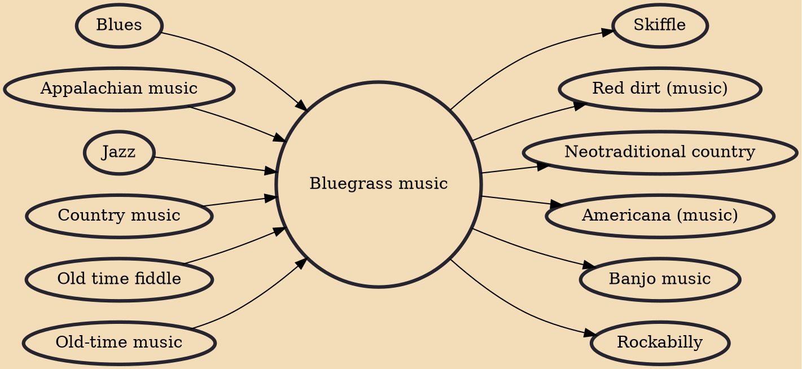

Bluegrass music is a genre of American roots music that developed in the 1940s in the Appalachian region of the United States. The genre derives its name from the band Bill Monroe and the Blue Grass Boys. Like mainstream country music, it largely developed out of old-time string music, though in contrast, bluegrass is traditionally played exclusively on acoustic instruments and also has roots in traditional English, Scottish, and Irish ballads and dance tunes as well as in blues and jazz. Bluegrass was further developed by musicians who played with Monroe, including 5-string banjo player Earl Scruggs and guitarist Lester Flatt. Monroe characterized the genre as: "Scottish bagpipes and ole-time fiddlin'. It's a part of Methodist, Holiness and Baptist traditions. It's blues and jazz, and it

## Influences

- [[Blues]]
- [[Appalachian music]]
- [[Jazz]]
- [[Country music]]
- [[Old time fiddle]]
- [[Old-time music]]

## Derivatives

- [[Skiffle]]
- [[Red dirt (music)]]
- [[Neotraditional country]]
- [[Americana (music)]]
- [[Banjo music]]
- [[Rockabilly]]
