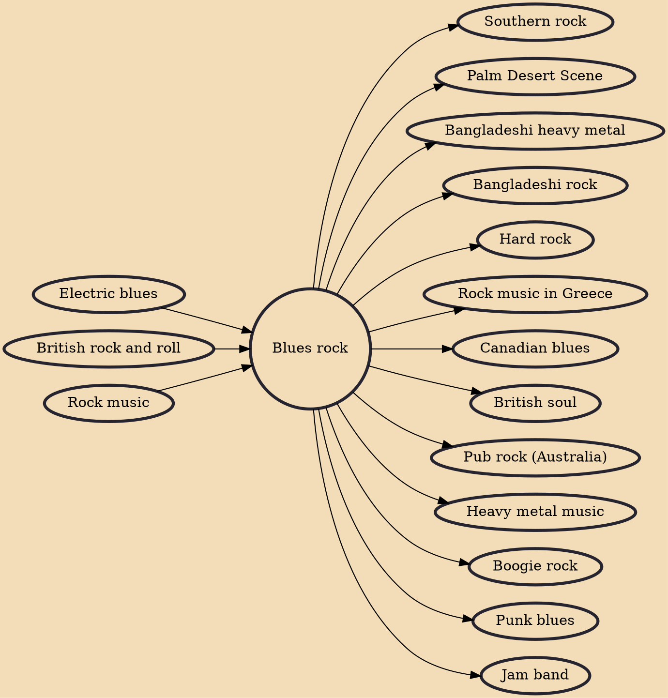

Blues rock is a fusion music genre that combines elements of blues and rock music. It is mostly an electric ensemble-style music with instrumentation similar to electric blues and rock (electric guitar, electric bass guitar, and drums, sometimes with keyboards and harmonica). From its beginnings in the early to mid-1960s, blues rock has gone through several stylistic shifts and along the way it inspired and influenced hard rock, Southern rock, and early heavy metal.

## Influences

- [[Electric blues]]
- [[British rock and roll]]
- [[Rock music]]

## Derivatives

- [[Southern rock]]
- [[Palm Desert Scene]]
- [[Bangladeshi heavy metal]]
- [[Bangladeshi rock]]
- [[Hard rock]]
- [[Rock music in Greece]]
- [[Canadian blues]]
- [[British soul]]
- [[Pub rock (Australia)]]
- [[Heavy metal music]]
- [[Boogie rock]]
- [[Punk blues]]
- [[Jam band]]
