```dot
digraph {
	graph [bgcolor="#F3DDB8" rankdir=LR]
	node [color="#26242F" penwidth=3.0]
	Blues [shape=circle]
	"Folk music" [URL="/folk-music/"]
	"Folk music" -> Blues
	Spirituals [URL="/spirituals/"]
	Spirituals -> Blues
	"Atlanta blues" [URL="/atlanta-blues/"]
	Blues -> "Atlanta blues"
	"Ryūkōka" [URL="/ryukoka/"]
	Blues -> "Ryūkōka"
	"Rock and roll" [URL="/rock-and-roll/"]
	Blues -> "Rock and roll"
	"Rock music" [URL="/rock-music/"]
	Blues -> "Rock music"
	"Jump blues" [URL="/jump-blues/"]
	Blues -> "Jump blues"
	"Piedmont blues" [URL="/piedmont-blues/"]
	Blues -> "Piedmont blues"
	"Southern rock" [URL="/southern-rock/"]
	Blues -> "Southern rock"
	"New flamenco" [URL="/new-flamenco/"]
	Blues -> "New flamenco"
	"Country blues" [URL="/country-blues/"]
	Blues -> "Country blues"
	"Banjo music" [URL="/banjo-music/"]
	Blues -> "Banjo music"
	"Uruguayan rock" [URL="/uruguayan-rock/"]
	Blues -> "Uruguayan rock"
	"Delta blues" [URL="/delta-blues/"]
	Blues -> "Delta blues"
	"Neotraditional country" [URL="/neotraditional-country/"]
	Blues -> "Neotraditional country"
	"Biker metal" [URL="/biker-metal/"]
	Blues -> "Biker metal"
	"Swing music" [URL="/swing-music/"]
	Blues -> "Swing music"
	Skiffle [URL="/skiffle/"]
	Blues -> Skiffle
	Zydeco [URL="/zydeco/"]
	Blues -> Zydeco
	"Roots rock" [URL="/roots-rock/"]
	Blues -> "Roots rock"
	"Electric blues" [URL="/electric-blues/"]
	Blues -> "Electric blues"
	"Southern soul" [URL="/southern-soul/"]
	Blues -> "Southern soul"
	"West Coast blues" [URL="/west-coast-blues/"]
	Blues -> "West Coast blues"
	"Hill country blues" [URL="/hill-country-blues/"]
	Blues -> "Hill country blues"
	"Louisiana blues" [URL="/louisiana-blues/"]
	Blues -> "Louisiana blues"
	"Big band" [URL="/big-band/"]
	Blues -> "Big band"
	"Psychedelic rock" [URL="/psychedelic-rock/"]
	Blues -> "Psychedelic rock"
	"Tulsa sound" [URL="/tulsa-sound/"]
	Blues -> "Tulsa sound"
	"Canadian blues" [URL="/canadian-blues/"]
	Blues -> "Canadian blues"
	"Bluegrass music" [URL="/bluegrass-music/"]
	Blues -> "Bluegrass music"
	"Soul jazz" [URL="/soul-jazz/"]
	Blues -> "Soul jazz"
	"Boogie-woogie" [URL="/boogie-woogie/"]
	Blues -> "Boogie-woogie"
	"Rock music of West Bengal" [URL="/rock-music-of-west-bengal/"]
	Blues -> "Rock music of West Bengal"
	"Chicago soul" [URL="/chicago-soul/"]
	Blues -> "Chicago soul"
	Jazz [URL="/jazz/"]
	Blues -> Jazz
	"Traditional bluegrass" [URL="/traditional-bluegrass/"]
	Blues -> "Traditional bluegrass"
	"Desert blues" [URL="/desert-blues/"]
	Blues -> "Desert blues"
	"British blues" [URL="/british-blues/"]
	Blues -> "British blues"
	"British soul" [URL="/british-soul/"]
	Blues -> "British soul"
	"African blues" [URL="/african-blues/"]
	Blues -> "African blues"
	Ragtime [URL="/ragtime/"]
	Blues -> Ragtime
	"Gospel blues" [URL="/gospel-blues/"]
	Blues -> "Gospel blues"
	"Folk baroque" [URL="/folk-baroque/"]
	Blues -> "Folk baroque"
	"Memphis blues" [URL="/memphis-blues/"]
	Blues -> "Memphis blues"
	Enka [URL="/enka/"]
	Blues -> Enka
	"Western swing" [URL="/western-swing/"]
	Blues -> "Western swing"
	"Occult rock" [URL="/occult-rock/"]
	Blues -> "Occult rock"
	"New Orleans blues" [URL="/new-orleans-blues/"]
	Blues -> "New Orleans blues"
	Marabi [URL="/marabi/"]
	Blues -> Marabi
	"Punk blues" [URL="/punk-blues/"]
	Blues -> "Punk blues"
	"Americana (music)" [URL="/americana-music/"]
	Blues -> "Americana (music)"
	"Outlaw country" [URL="/outlaw-country/"]
	Blues -> "Outlaw country"
	"Texas blues" [URL="/texas-blues/"]
	Blues -> "Texas blues"
	"Traditional black gospel" [URL="/traditional-black-gospel/"]
	Blues -> "Traditional black gospel"
	"Samba rock" [URL="/samba-rock/"]
	Blues -> "Samba rock"
	"Car song" [URL="/car-song/"]
	Blues -> "Car song"
	"Doom metal" [URL="/doom-metal/"]
	Blues -> "Doom metal"
	"Country music" [URL="/country-music/"]
	Blues -> "Country music"
	"Swamp blues" [URL="/swamp-blues/"]
	Blues -> "Swamp blues"
	"Red dirt (music)" [URL="/red-dirt-music/"]
	Blues -> "Red dirt (music)"
	"Kayōkyoku" [URL="/kayokyoku/"]
	Blues -> "Kayōkyoku"
	"Hard bop" [URL="/hard-bop/"]
	Blues -> "Hard bop"
	"Memphis soul" [URL="/memphis-soul/"]
	Blues -> "Memphis soul"
	"Rhythm and blues" [URL="/rhythm-and-blues/"]
	Blues -> "Rhythm and blues"
	"Garage rock" [URL="/garage-rock/"]
	Blues -> "Garage rock"
	"Kansas City jazz" [URL="/kansas-city-jazz/"]
	Blues -> "Kansas City jazz"
	"Brazilian rock" [URL="/brazilian-rock/"]
	Blues -> "Brazilian rock"
	"Tejano music" [URL="/tejano-music/"]
	Blues -> "Tejano music"
}
```

Blues is a music genre and musical form which originated in the Deep South of the United States around the 1860s. Blues incorporated spirituals, work songs, field hollers, shouts, chants, and rhymed simple narrative ballads from the African-American culture. The blues form is ubiquitous in jazz, rhythm and blues, and rock and roll, and is characterized by the call-and-response pattern (the blues scale and specific chord progressions) of which the twelve-bar blues is the most common. Blue notes (or "worried notes"), usually thirds, fifths or sevenths flattened in pitch, are also an essential part of the sound. Blues shuffles or walking bass reinforce the trance-like rhythm and form a repetitive effect known as the groove.

## Influences
- [[Folk music]]
- [[Spirituals]]

## Derivatives
- [[Atlanta blues]]
- [[Ryūkōka]]
- [[Rock and roll]]
- [[Rock music]]
- [[Jump blues]]
- [[Piedmont blues]]
- [[Southern rock]]
- [[New flamenco]]
- [[Country blues]]
- [[Banjo music]]
- [[Uruguayan rock]]
- [[Delta blues]]
- [[Neotraditional country]]
- [[Biker metal]]
- [[Swing music]]
- [[Skiffle]]
- [[Zydeco]]
- [[Roots rock]]
- [[Electric blues]]
- [[Southern soul]]
- [[West Coast blues]]
- [[Hill country blues]]
- [[Louisiana blues]]
- [[Big band]]
- [[Psychedelic rock]]
- [[Tulsa sound]]
- [[Canadian blues]]
- [[Bluegrass music]]
- [[Soul jazz]]
- [[Boogie-woogie]]
- [[Rock music of West Bengal]]
- [[Chicago soul]]
- [[Jazz]]
- [[Traditional bluegrass]]
- [[Desert blues]]
- [[British blues]]
- [[British soul]]
- [[African blues]]
- [[Ragtime]]
- [[Gospel blues]]
- [[Folk baroque]]
- [[Memphis blues]]
- [[Enka]]
- [[Western swing]]
- [[Occult rock]]
- [[New Orleans blues]]
- [[Marabi]]
- [[Punk blues]]
- [[Americana (music)]]
- [[Outlaw country]]
- [[Texas blues]]
- [[Traditional black gospel]]
- [[Samba rock]]
- [[Car song]]
- [[Doom metal]]
- [[Country music]]
- [[Swamp blues]]
- [[Red dirt (music)]]
- [[Kayōkyoku]]
- [[Hard bop]]
- [[Memphis soul]]
- [[Rhythm and blues]]
- [[Garage rock]]
- [[Kansas City jazz]]
- [[Brazilian rock]]
- [[Tejano music]]
