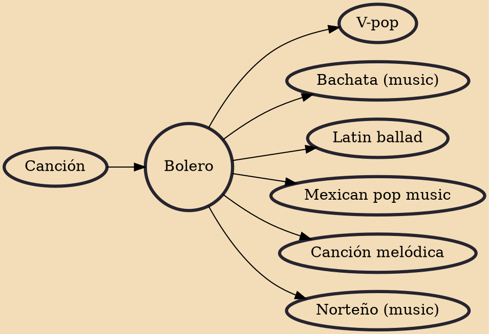

Bolero is a genre of song which originated in eastern Cuba in the late 19th century as part of the trova tradition. Unrelated to the older Spanish dance of the same name, bolero is characterized by sophisticated lyrics dealing with love. It has been called the "quintessential Latin American romantic song of the twentieth century".

## Influences

- [[Canción]]

## Derivatives

- [[V-pop]]
- [[Bachata (music)]]
- [[Latin ballad]]
- [[Mexican pop music]]
- [[Canción melódica]]
- [[Norteño (music)]]
