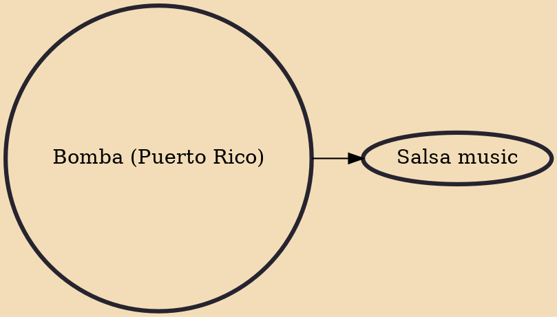

Bomba is both a traditional dance and musical style of Puerto Rico. Its origins are rooted in the island's history of African slavery but today has evolved into a community expression of Puerto Rican culture. While Bomba can be used as the generic name for a number of rhythms, it is truly about a creative, interactive relationship between dancers, percussionists and singers. Today it's practiced as a communal activity in its centers of origin in Loíza, Santurce, Mayagüez and Ponce. Also, Puerto Rican migrants have brought the tradition to some parts of the U.S. mainland.

## Derivatives

- [[Salsa music]]
