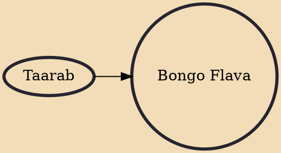

Bongo Flava (or Bongoflava) is a nickname for Tanzanian music. The genre developed in the 1990s, mainly as a derivative of American hip hop and traditional Tanzanian styles such as taarab and dansi, with additional influences from reggae, R&B, and afrobeats, to form a unique style of music. Lyrics are usually in Swahili or English, although increasingly there has been limited use of words from Nigerian languages due to the influence of afrobeats.

## Influences

- [[Taarab]]
