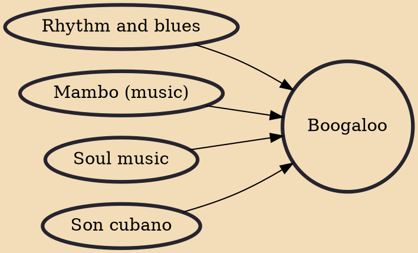

Boogaloo or bugalú (also: shing-a-ling, Latin boogaloo, Latin R&B) is a genre of Latin music and dance which was popular in the United States in the 1960s. Boogaloo originated in New York City mainly among teenage African Americans and Latinos. The style was a fusion of popular African American rhythm and blues (R&B) and soul music with mambo and son montuno, with songs in both English and Spanish. The American Bandstand television program introduced the dance and the music to the mainstream American audience. Pete Rodríguez's "I Like It like That" was a famous boogaloo song.

## Influences

- [[Rhythm and blues]]
- [[Mambo (music)]]
- [[Soul music]]
- [[Son cubano]]
