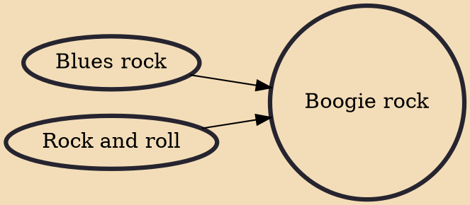

Boogie rock is a style of blues rock music that developed in the late 1960s. Its key feature is a repetitive driving rhythm, which emphasizes the groove. Although inspired by earlier musical styles, boogie rock has been described as "heavier" or "harder-edged" in its instrumental approach. The term has been applied to two styles: Boogie rock has also been used to generally describe blues rock performers who emphasize "a back-to-basics approach typified by more simple chord structures and straightforward lyrics" rather than showmanship and instrumental virtuosity.

## Influences
- [[Blues rock]]
- [[Rock and roll]]
